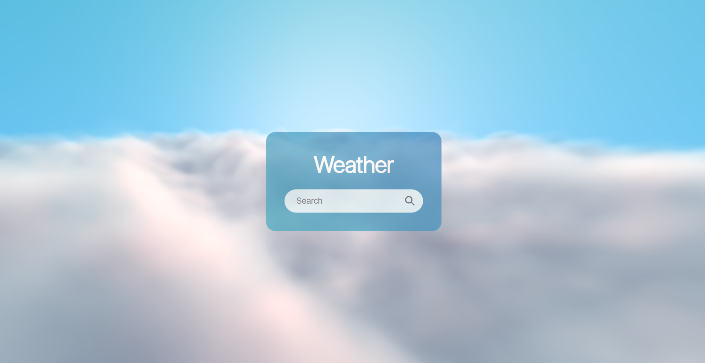

# Weather App

This project is a weather application built with React. It allows users to search for the current weather in any city and displays detailed information such as temperature, humidity, wind speed, and more. The background dynamically adjusts based on the weather conditions (clear, cloudy, rain, snow, thunderstorm).

## Features

- **Weather Search**: Users can input the name of any city to fetch its current weather.
- **Dynamic Background**: The background changes according to the weather type (clear, clouds, rain, snow, thunderstorm) using the Vanta.js library.
- **Weather Data**: Displays temperature, humidity, wind speed, and other details.
- **Error Handling**: Uses Ant Design's `message` component to handle and display error messages.

## Technologies Used

- **React**: A JavaScript library for building user interfaces.
- **Vanta.js**: A 3D animation library to create visually appealing backgrounds based on weather conditions.
- **OpenWeatherMap API**: Provides weather data for different cities.
- **Ant Design**: A popular React UI framework used for displaying error messages and loading indicators.
- **React Icons**: Used for the search button icon.

## Setup and Installation

### Prerequisites

To run this project, you need to have the following installed:

- Node.js
- npm (Node package manager)

### Steps

1. **Clone the repository**:

   ```bash
   git clone https://github.com/your-username/weather-app.git
   cd weather-app
   ```

2. **Install dependencies**:

   ```bash
   npm install
   ```

3. **Run the development server**:

   ```bash
   npm start
   ```

4. Open the application in your browser by navigating to `http://localhost:3000`.

## How It Works

1. **App Component**:

   - The `App` component manages the state for the weather type (clear, cloudy, rain, etc.).
   - It passes the weather type to the `Weather` and `VantaBackground` components.

2. **Weather Component**:

   - Allows users to search for a city.
   - Fetches weather data from the OpenWeatherMap API.
   - Displays the weather data, including temperature, humidity, and wind speed.
   - If an error occurs (e.g., invalid city name or API issues), it shows an error message using Ant Design.

3. **VantaBackground Component**:

   - Sets up a dynamic background using the Vanta.js library.
   - The background changes color and animation based on the weather type.

4. **WeatherInput Component**:

   - A form component that allows the user to enter a city name and trigger the weather search.

5. **WeatherData Component**:

   - Displays the main weather data like temperature and location.
   - Uses `WeatherSecondaryData` for additional weather details like humidity and wind speed.

6. **WeatherSecondaryData Component**:
   - Displays additional weather data with corresponding icons (humidity, wind speed).

## Screenshots



### Video Demonstration

Watch the demo video below:

![Demo Video]
(./screenshots/demo.mp4)
(https://drive.google.com/file/d/1g0GzuJy2fl3bF0HBZLwkAQCBwAirNt6w/view?usp=sharing)

## Troubleshooting

- If you encounter any issues with fetching data from the OpenWeatherMap API, ensure your API key is correct.
- If the background animation is not working, make sure you have installed the `vanta` library correctly and are passing the correct weather type to the `VantaBackground` component.

## License

This project is licensed under the MIT License.
Copyright (c) [2024] [Samvel Toroyan]

---

### Русская версия:

# Weather App

Этот проект представляет собой приложение для отображения текущей погоды, построенное с использованием React. Приложение позволяет пользователю искать погоду в любом городе и отображать подробную информацию, такую как температура, влажность, скорость ветра и другие данные. Фон приложения динамически изменяется в зависимости от погодных условий (ясно, облачно, дождь, снег, гроза).

## Особенности

- **Поиск погоды**: Пользователи могут вводить название города для получения текущей погоды.
- **Динамический фон**: Фон изменяется в зависимости от типа погоды (ясно, облачно, дождь, снег, гроза) с использованием библиотеки Vanta.js.
- **Данные о погоде**: Отображаются температура, влажность, скорость ветра и другие параметры.
- **Обработка ошибок**: Ошибки отображаются с использованием компонента `message` из Ant Design.

## Используемые технологии

- **React**: Библиотека JavaScript для создания пользовательских интерфейсов.
- **Vanta.js**: Библиотека для создания 3D-анимированных фонов, которые меняются в зависимости от погоды.
- **OpenWeatherMap API**: Источник данных о погоде для различных городов.
- **Ant Design**: Популярный UI-фреймворк для React, используемый для отображения сообщений об ошибках и индикаторов загрузки.
- **React Icons**: Иконки для кнопок, например, иконка для поиска.

## Установка и настройка

### Требования

Для запуска этого проекта необходимо установить:

- Node.js
- npm (менеджер пакетов для Node.js)

### Шаги

1. **Клонировать репозиторий**:

   ```bash
   git clone https://github.com/your-username/weather-app.git
   cd weather-app
   ```

2. **Установить зависимости**:

   ```bash
   npm install
   ```

3. **Запустить сервер для разработки**:

   ```bash
   npm start
   ```

4. Откройте приложение в браузере, перейдя по адресу `http://localhost:3000`.

## Как это работает

1. **Компонент App**:

   - Управляет состоянием типа погоды (ясно, облачно, дождь и т.д.).
   - Передаёт тип погоды в компоненты `Weather` и `VantaBackground`.

2. **Компонент Weather**:

   - Позволяет пользователям искать город.
   - Получает данные о погоде через API OpenWeatherMap.
   - Отображает данные о погоде, включая температуру, влажность и скорость ветра.
   - В случае ошибки (неверное имя города или проблемы с API) отображает сообщение об ошибке с использованием Ant Design.

3. **Компонент VantaBackground**:

   - Настроен для динамического фона с помощью библиотеки Vanta.js.
   - Фон меняет цвет и анимацию в зависимости от типа погоды.

4. **Компонент WeatherInput**:

   - Форма для ввода названия города и запуска поиска погоды.

5. **Компонент WeatherData**:

   - Отображает основные данные о погоде, такие как температура и местоположение.
   - Использует компонент `WeatherSecondaryData` для отображения дополнительных данных, таких как влажность и скорость ветра.

6. **Компонент WeatherSecondaryData**:
   - Отображает дополнительные данные о погоде с соответствующими иконками (влажность, скорость ветра).

## Решение проблем

- Если возникнут проблемы с получением данных от API OpenWeatherMap, убедитесь, что ваш API-ключ правильный.
- Если анимация фона не работает, убедитесь, что библиотека `vanta` установлена корректно и что вы передаёте правильный тип погоды в компонент `VantaBackground`.

## Лицензия

Этот проект лицензирован под лицензией MIT.
Copyright (c) [2024] [Samvel Toroyan]
